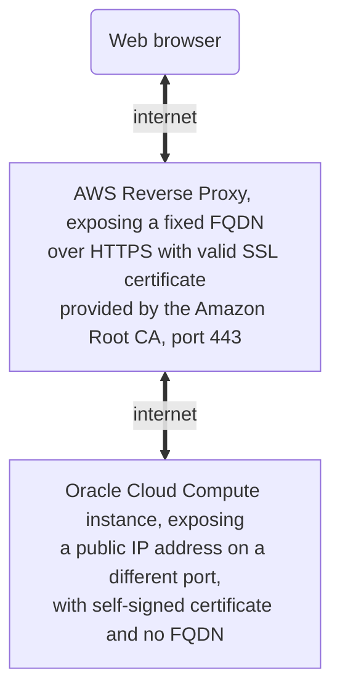

# aws-lambda-reverse-proxy
A simple Python Reverse Proxy using AWS Lambda

## Description

This program and related setup implements a simple http based request/response [reverse proxy application](https://en.wikipedia.org/wiki/Reverse_proxy) exposing to internet a default AWS auto-generated public fully functional https [endpoint](https://docs.aws.amazon.com/general/latest/gr/apigateway.html) that automatically uses the [lambda Function URL](https://docs.aws.amazon.com/lambda/latest/dg/lambda-urls.html) certificate or the [Amazon API Gateway](https://aws.amazon.com/api-gateway/) certificate (or a custom one).

This reverse proxy application is able to inspect the received https request from the client (web browser) and to forward it to an http or https internet backend; in turn, when receiving the response from the backend, it is delivered to the client on the internet (e.g., web browser), which is unaware of the backend service IP address and related protocol, that can be HTTP or https with [self-signed SSL certificate](https://en.wikipedia.org/wiki/Self-signed_certificate), using the same port or a different one.

The http API endpoint includes a valid AWS certificate and allows HTTPS.

Features:
- configurable remote URL
- [request/response](https://en.wikipedia.org/wiki/Request%E2%80%93response) mode
- all standard http methods are supported (e.g., GET, POST, ..)
- management of general connection and timeout errors of the backend site, including a splash page in case the remote backend is down
- exposing a public [FQDN](https://en.wikipedia.org/wiki/Fully_qualified_domain_name) with valid SSL certificate provided by the Amazon Root CA
- providing HTTS end-point with public FQDN to a non-secure HTTP backend (e.g., a computing resource), or to an HTTPS backend that uses a non-trusted self-signed SSL certificate
- forwarding and integrating http headers and cookies between browser and backend
- configurable filtered path (or paths) with simple warning page
- allowing special `&trace_connection=y` and `&dump_request=y` debug queries (see below)
- allowing up to 6 MB payload, with reference to the AWS Lambda quota (e.g., usable for small web pages and small-sized resources like icons, images, documents, etc.)

Limitations:
- the max response size must be within 6 MB
- progressively streaming response payloads is not supported (only the request/response mode is allowed)

### Tested architecture

Tested to integrate an always-free Oracle Cloud OCI computing resource.



## Setup the needed AWS resources

### Create a Python-based AWS Lambda function

[AWS Lambda](https://aws.amazon.com/lambda/?nc2=h_ql_prod_fs_lbd) is a [serverless computing service](https://aws.amazon.com/getting-started/hands-on/run-serverless-code/?nc1=h_ls) included in the [free tier](https://aws.amazon.com/lambda/pricing/?loc=ft#Free_Tier) of Amazon Web Services (AWS), including one million free requests per month and 400000 GB-seconds of compute time per month.

- AWS > Lambda > Functions > Create function
  - select "Author from scratch"
  - Function name: rproxy
  - Runtime: Python 3.11
  - Architecture: x86_64
  - Permissions: Create a new role with basic Lambda permissions

- Press Create Function

### Option 1 - Add a "Function URL" to the AWS Lambda function

The configuration of a [Function URL](https://docs.aws.amazon.com/lambda/latest/dg/lambda-urls.html) is the preferred method, as does not imply the introduction of the fixed "HTTP API Gateway" timeout of 30 secs. Option 2 seems to better change long URLs. Both option can be concurrently active.

- AWS > Lambda > Functions > rproxy
  - select "Configuration"
  - select "Function URL"
  - press "Create function URL"
  - select "Auth type": "NONE"
  - press "SAVE"
  - read the "Function URL" (`https://<url-id>.lambda-url.<region>.on.aws`) in the rproxy lambda function configuration
  
- Test this URL in another browser tab; you should get "Hello from Lambda!"

- Add `/test` to the URL: `https://<url-id>.lambda-url.<region>.on.aws/test`

- You should still get "Hello from Lambda!" (this means that the Function URL works with all paths).

### Option 2 - Link an HTTP API Gateway to trigger the AWS Lambda function

As alternative option to the usage of a "Function URL", an "HTTP API Gateway" can be created.

[Amazon HTTP API Gateway](https://aws.amazon.com/api-gateway/?nc1=h_ls) provides a public HTTPS endpoint to the AWS Lambda function and automatically assigns a domain to the API, with a FQDN that uses a valid Amazon API Gateway certificate. It does not generate costs in case of limited number of small-sized requests per month (e.g., 4000 requests per month, with 512 KB each).

- Press Add trigger

- Select Api Gateway

- Select "Create an API"
  - Select "HTTP API"
  - Security: Open

- Press Add

- Press "rproxy-API" in "API Gateway: rproxy-API"

- Press "Routes"

- Press Create

- Route and method: `ANY` `/{proxy+}`

- Notes on using the `ANY` `/{proxy+}` integration:
  - https://docs.aws.amazon.com/apigateway/latest/developerguide/set-up-lambda-proxy-integrations.html
  - https://docs.aws.amazon.com/apigateway/latest/developerguide/api-gateway-set-up-simple-proxy.html
  Note: this code requires Payload format version 2.0 (interpreted response format) for integration (might not work with version 1).

- Press Create

- Select "ANY" in "`/rproxy`" (not `/{proxy+}`)

- Press Delete (and confirm).

- You shoud have 
  ```
  $default
    /{proxy+}
      ANY
  ```

- Press ANY

- Press "Attach integration"

- Select rproxy (your AWS Lambda function)

- Press "Attach integration"

- Notice:
  Payload format version: 2.0
  Timeout: 30000 msec

- Press again "API Gateway" on the top.

- Press "rproxy-API"

- Select "default" (not $default)

- Check that "default" is selected (not $default) and press "Delete". Confirm.
  Note: if $default is missing, select "Stages" and add one named "$default", selecting "Enable automatic deployment". When done, you can remove the "default" Stage.

- Press again "API Gateway" on the top.

- Press "rproxy-API"

- You should just have `"$default"	https://....execute-api....amazonaws.com/`

- Test the URL in another browser tab; you should get "Hello from Lambda!"

- Add `/test` to the URL: https://....execute-api....amazonaws.com/test

- You should still get "Hello from Lambda!" (this means that the proxy gateway works with all paths).

- Go back to AWS > Lambda > Functions >rproxy

- Press Triggers (and do a refresh on this page)

- You might have two API Gateway items:
  ```
  rproxy-API
  API endpoint: https://https://....execute-api....amazonaws.com/{proxy+}
  ```
  and another one, with `arn:aws:execute-api.../*/*/rproxy`.

- Remove the second one (select it and press Delete), so that only the `/{proxy+}` is configured.

### Replace the default Python code with the reverse proxy

- Go back to AWS > Lambda > Functions >rproxy

- Select "General configuration". Configure the memory (e.g., 512 MB) and the timeout (e.g., 40 secs). Press Save.

- Press "Environment variables".

- Add `REMOTE_URL` and `FILTERED_PATH` (see below). For testing, use `REMOTE_URL=https://httpbin.org` and `FILTERED_PATH=/foobar|/baz`

- Press Code.

- Paste the code from this repo (replacing the default code).

- Press "Deploy".

- Select "Runtime settings" and press Edit.

- Change the Handler: `lambda_function.proxy_handler`.

- Press Save.

### Test the configuration

- Test again the page: `https://...`. You should get the https://httpbin.org home page.

- Test `https://.../foobar`; you should get a "Filtered URL." error (if using `FILTERED_PATH=/foobar`).

- Test `https://.../baz`; you should get a "Filtered URL." error (if using `FILTERED_PATH=/foobar|/baz`).

- Test `https://.../cookies/set/:name/:value`; you should get the cookie named `:name:` set to `:value`.

- Test `https://.../headers`; you should get the list of headers of your function, as obtained by https://httpbin.org/headers; included in the headers there should be `"Cookie": ":name=:value",`

- Test `https://.../headers?dump_request=y`; you should get the dump of the `event` and `context` variables of `proxy_handler()`.

- Test `https://.../headers?trace_connection=y`; you should read tracing information in the CloudWatch Logs (e.g., `/usr/local/bin/aws logs tail /aws/lambda/rproxy  --follow`).

- Try testing [other paths](https://stackoverflow.com/a/9770981/10598800).

In case of error, run `/usr/local/bin/aws logs tail /aws/lambda/rproxy --follow` and see the logs.

## Installation of awscli

Installation of awscli on Unix (or [WSL](https://docs.microsoft.com/windows/wsl/about)) to trace the AWS Lambda function:

```bash
# Install awscli:
curl "https://awscli.amazonaws.com/awscli-exe-linux-x86_64.zip" -o "awscliv2.zip"
unzip awscliv2.zip
sudo ./aws/install
/usr/local/bin/aws --version

# Configure awscli:
/usr/local/bin/aws configure
```

## Tracing

(After installing `awscli`)

```bash
/usr/local/bin/aws logs tail /aws/lambda/<function name> --follow
```

## Needed environment variables

`REMOTE_URL`: remote URL of the backend application (http or https). Example: https://httpbin.org

`FILTERED_PATH`: (optional) path that needs to be filtered. A list of paths can be used, by separating each path with a pipe character (`|`). Example: `/foobar|/baz`.

`NO_HEADERS`: (optional) when existing and set, do not forward headers.

Optional parameters:

- `GENERAL_ERROR`: title of the error message; default is "AWS Lambda Error"
- `PAYLOAD_QUOTA`: max payload size; default is 5000000 bytes (size of the answer from the backend portal)
- `REQUEST_TIMEOUT`: timeout to wait for the answer from the backend portal; default is 11.0 seconds
- `APP_NAME`: application name; default is "Sample Application"
- `FILTERED_URL_MSG`: filtered URL message; default is "Filtered URL."

## Special parameters

- `&trace_connection=y`: trace information to [CloudWatch log](https://docs.aws.amazon.com/AmazonCloudWatch/latest/logs/WhatIsCloudWatchLogs.html); logs can be inspected via [`aws logs tail /aws/lambda/<function name> --follow`](https://awscli.amazonaws.com/v2/documentation/api/latest/reference/logs/tail.html)
- `&dump_request=y`: dump the request, producing a page that describes the http request attributes (cookies, headers, path, query string, parameters, AWS context, etc.).
